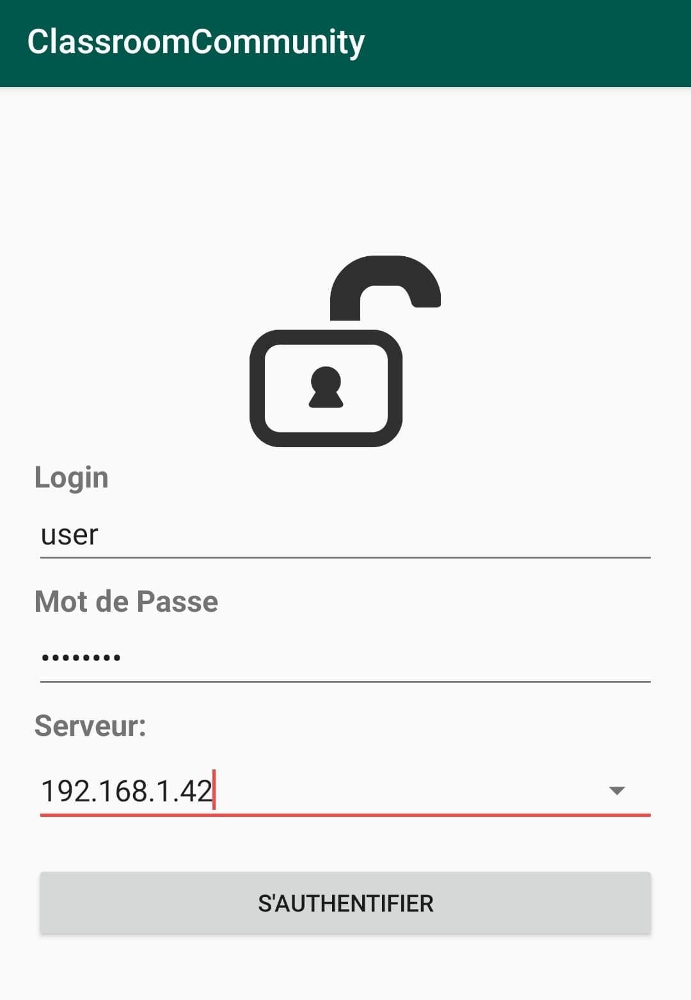

# ClassroomQuizz

## Description

ClassroomQuizz est un projet android développé sous Android Studio en Java dont le but est de proposer à l'utilisateur finale de pouvoir repondre à des questions à choix multiple avec un temps donné et ceci en défiant ces différents amis.
De plus certaines autres fonctionnalités facultatives et à but pédagogique ont été rajouter

## Installation

Pour installer le projet il faut d'abord créer un serveur avec la base SQL iot_db ainsi que l'API iot-server.
Puis il faut installer l'apk et donner le droit à l'application d'accéder au fichier et dossier de l'appareil.
Au lancement de l'application celle-ci vous demandera de rentrer un login et un mot de passe, vous pouvez entrer "user" et "password".
Puis plus bas il faudra renseigner l'adresse du serveur et vous pourrez vous connecter

  

Pour cetaintes fonctionnalités l'application peut vous demander l'autorisation d'utiliser le bluetooth ainsi que l'appareil photo

Tout les fichiers nécessaires sont disponible dans le dossier "build"

## Caractéristiques

* Connection
* QCM
* Liste d'amis
* Chat
* Stream vidéo rtsp
* Scanner QRCODE
* Capteur Bewii
* Déconnexion

## Technologies utilisées

* Java
* xml
* PHP
* SQL
* WebSocket

## Outils utilisés

* Android Studio
* Visual Studio Code
* XAMPP

### Remarque

le multijoueur n'est pas encore implémenté car nous sommes en attente des websockets ainsi que de la ou les tables de la base de donnée qui permettrait son implémentation